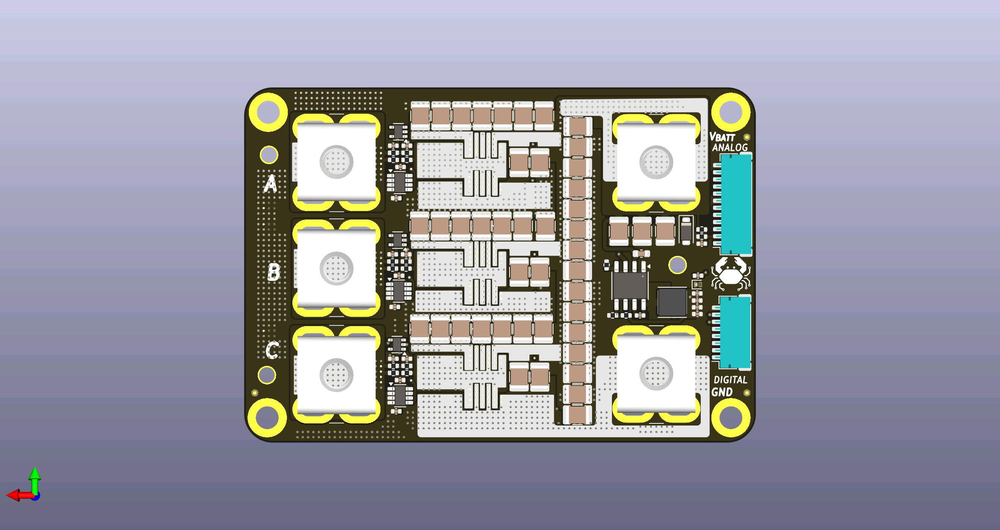
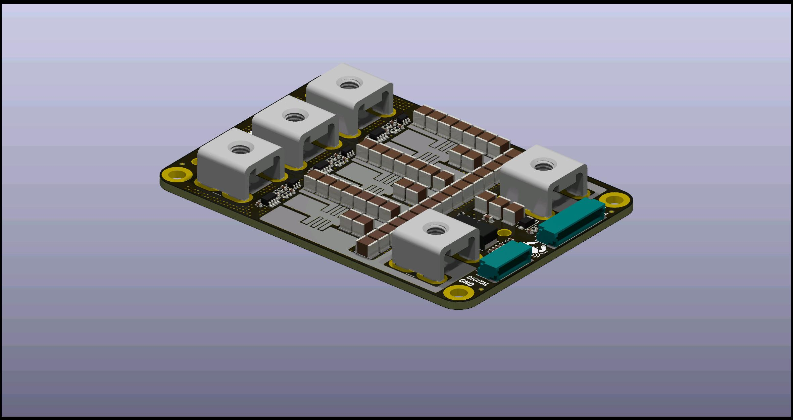
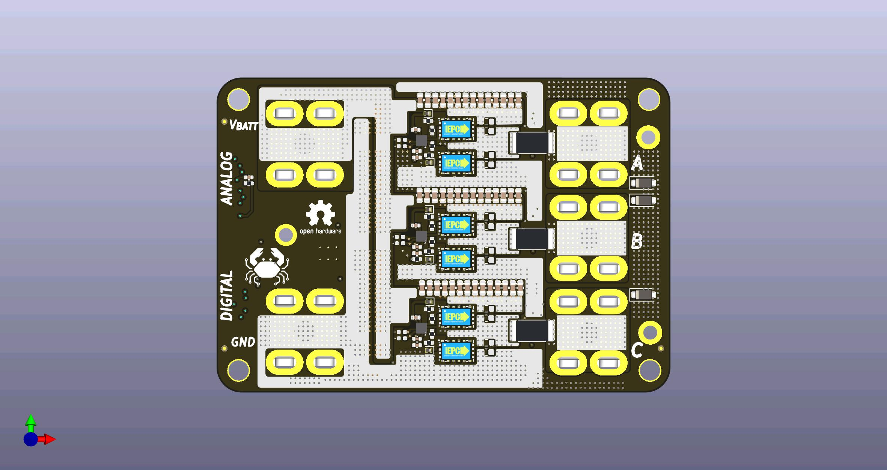
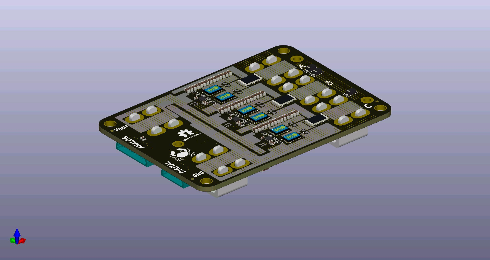

# OpenMD

An Open Source Versatile Motor Driver powered by GaN

## Authors

[Orion Serup](orion@crablabs.io)

## Licensing

This project is licensed under the CERN Open Hardware License Version 2 - Weakly Reciprocal.

Different licensing can be provided for a nominal fee to allow for private spins of the design, contact the authors for more information on cost and license options.

## Operational Parameters

These are the initial estimates for reasonable limits provided sufficient cooling and stable power.

- Operating Voltage: 7V-80V
- Operating Current: 70A
- Max Theoretical Power: 4kW
- Switching Frequency: 50kHz-150KHz

## Purchasing

As of now this product is in Beta and thus is not publicly available for sale. Pre-production units may be available for evaluation, contact the authors for more information.
